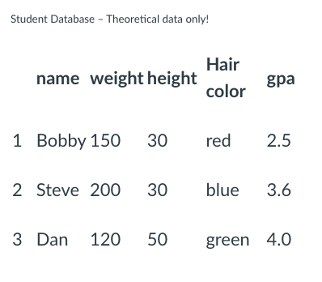
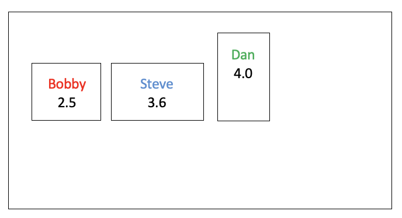
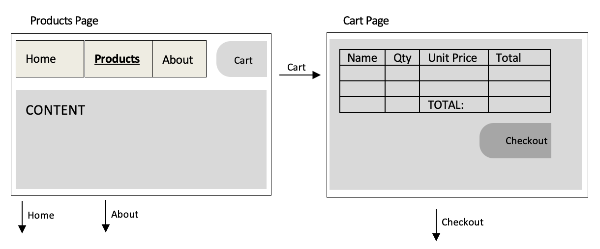

# Assignment 2
## Description
You are commissioned to create an application to track a group of students.  Your app will have the ability to add new students, change student attributes, and delete students.  
## Technical Requirements
**Database**: you should create a database table (called “Student”) to collect information about a series of Students. The minimum attributes for the Students are name, weight, height, hair color, and gpa. In addition, you may add as many other Student attributes as you’d like (Be creative: P). 

**Application**: Your Spring app should have the following features (I would suggest making a separate endpoint for each):
1. The ability to add new Students (with corresponding attributes).
2. The ability to change attributes of any of the Students. A form should be displayed for this feature with the existing attributes already filled in. 
3. The ability to delete any of the Students
4. The ability to display (draw) all Students currently in the database (including any other information you collect) in the **form of rectangles** (hint: use a `
` or `` tag). For example, if you currently have three Students in your database as follows:

The display page **could** look something like this:

Notice that Bobby and Steve have the same height, but Steve is proportionally heavier, Dan weighs less and is taller than Bobby and Steve. Notice also that the students are displayed using their associated colours and sizes. Although not shown in the image above, I recommend including links allowing the user to delete or update a student from this page.  For example, clicking on the rectangle 'Steve' could like the user to the updated student 'Steve' page.  

In addition, you may also add or display any other attributes you wish.  Please note that the requirement stated above is a minimum list; you may add to them as you see fit.  Also, include a list of features for your web application in a README file (in case they are not immediately evident).  Please be creative as part of your grade will be usability and creativity.

The exact workflow is totally up to you.  I suggest beginning with a UI mockup of your app.  You may use any tool that you desire (including by hand).  This assignment may be trivial, but you must include this as part of your documentation in subsequent project iterations. The UI mockup should contain your views/templates (pages) and how they are linked.  As a small example, a UI mockup for part of a bakery (buying) website could look like the following:

This is a good logical starting point because it will give you a general picture of attributes that exist in your model so you can limit the number migrations you may have.

### Submission

Your webpage must be stored on a hosting site (render.com or railway.app). As with all subsequent assignments/project iterations, you should submit the following onto Canvas.
1. The URL of your `web app`, this is where we’ll be able to play around with your application
2. Your `Github link`, this is where we can view your Spring project code, your progress and the time of submission

## My Application
* Using **Render PostgresSQL** for storing Student Information
* Using **Thymleaf** as template engine to communicate between backend and frontend.